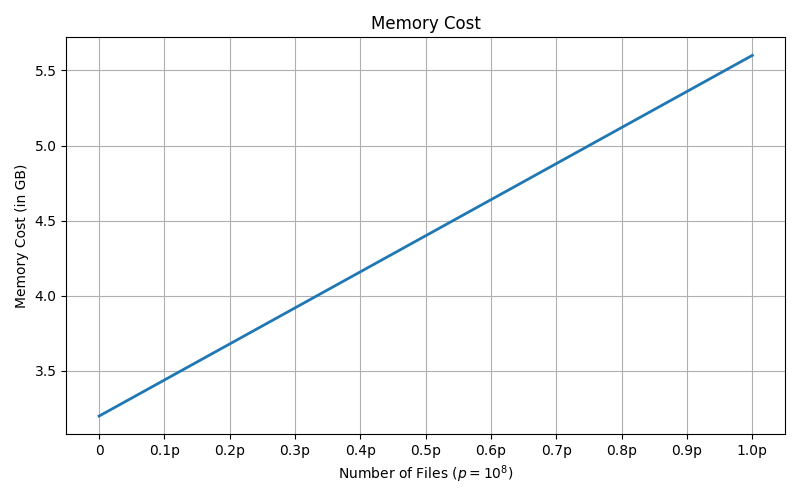

#+title: Snapper-v3
#+author: Rumen Mitov
#+email: rumen.mitov@constructor.tech

#+latex: \clearpage

* DONE Introduction
Snapper 3.0 (henceforth known as just Snapper) is a mechanism for organizing snapshot data on top of a file-system. Snapper is implemented as a Genode[fn:1] component allowing it to be used by any other component in the system that wants to store data in persistent snapshots. Each snapshot is divided into payloads, with each payload being saved in its own file. Future snapshots may make use of files in earlier snapshots, instead of creating new ones.

Snapper is agnostic to the data stored. The component that utilizes Snapper to store its information is also responsible for interpreting the data upon restoration. The key distinction of Snapper 3.0 and its predecessors, is its incorporation of Content-Based Page Sharing[fn:2] to enable efficiency improvements when taking and purging snapshots.

* DONE Definitions
Changes and simplifications have been made from the Snapper 2.0 whitepaper. This paper relies solely on the following definitions.

** Snapper
The Genode component that serves to take and organize snapshots of arbitrary data.

** Client (Component)
The Genode component that uses Snapper.

** Chunk
A partition of the client component's data. Each chunk has a unique chunk identity (=chunkid=, a 64-bit unsigned integer).

** Snapshot
Data stored on disk, and managed by Snapper. Each snapshot has a unique snapshot identity (=snapid=, 64-bit unsigned integer). The =snapid= is a UNIX timestamp of when the snapshot was initialized. If a new snapshot is initialized and its UNIX timestamp matches an already existing =snapid=, the new snapshot's identifier will be =snapid= + 1.

** Payload
The state of a chunk in a snapshot. Payloads can be distinguished by the tuple \langle =snapid=, =chunkid= \rangle.

Note that the same payload \langle =snapid=, =chunkid= \rangle cannot be overwritten (unless the snapshot was aborted before it was committed).

** Snapshot File
Responsible for storing a payload in a snapshot.

** Redundant Files
A set of snapshot files all have identical contents. Each set of redundant files has a unique redundant file identity (=rfid=, a 64-bit unsigned integer). Each set of redundant files resides in the its own sub-directory.

Hence, if a hash collision occurs between two distinct payloads (regardless if both are of the same or of different snapshots), then each would belong to a separate redundant file set.

#+latex: \clearpage

* DONE Snapper's Structures

#+begin_example
                                      +-----------------+              
                                      |   snapper-root  |              
                                      +--------+--------+              
                                               |                       
        +--------------------------------------+
        |                                      |
     archive                          +--------+---------+
                                      |  snapshot_files  |
                                      +--+-----+---------+
                                               |
                          +--------------------+-------------+-------------+
                          |                    |             |             |
                        +-+--+               +-+--+       +--+--+        +-+--+
                        | 00 |               | 01 |       | ... |        | ff |
                        +-+--+               +-+--+       +--+--+        +-+--+
                          |                    |             |             |
                 +--------+--------+          ...           ...           ...
                 |        |        |
               +-+--+  +--+--+   +-+--+
               | 00 |  | ... |   | ff |
               +-+--+  +--+--+   +-+--+
                 |        |        |
                ...      ...      ...  /* a total of 8 levels of sub-directories
                                   |      for the hash */
                      +------------+-------------------+
                      |            |                   |
                    +-+--+      +--+--+              +-+--+
                    | 00 |      | ... |              | ff |
                    +-+--+      +--+--+              +-+--+
                      |            |                   |
                     ...          ...               +--+---+
                                                    | rfid |
                                                    +--+---+
                                                       |
                                              +--------+--------+
                                              |        |        |
                                            snap-i   snap-j    ...
#+end_example

#+LATEX: \clearpage

- snapper-root

  The root directory within which Snapper operates. The snapper-root stores the snapshots for exactly one client component. For multiple clients, separate Snapper components are required.
  
- archive

  The archive file; stores the latest archive structure.
  
- snapshot-files

  The directory that stores all snapshot files; the files are organized by the first 64-bits of their hashes.
  
- rfid

  Sub-directory storing a set of redundant files; _rfid_ refers to the redundant file identifier of the set of files stored within.
  
- snap-t

  A snapshot file; _t_ refers to the string =snapid.chunkid= (values taken from the identifier of the payload that created the file).
  

** The Archive
The =Snapper::archive= structure is a singleton object responsible for storing three dictionaries: the =Snapper::archive::payloadmap=, the =Snapper::archive::filemap=, and the =Snapper::archive::snapmap=. The dictionaries represent the following mappings:

\[ payloadmap : \langle snapid, chunkid \rangle \longrightarrow rfid \]

\[ filemap : rfid \longrightarrow \langle hash, rc \rangle \]

\[ snapmap : snapid \longrightarrow [rfid] \]

=Snapper::archive::payloadmap= is used for lookups for snapshot files (i.e. when taking a snapshot, or restoring one). The =rfid= is used to select a set of redundant files. All snapshot files in a redundant file set contain identical contents.

=Snapper::archive::filemap= is used determine how many payloads from all snapshots (i.e. the reference count, =rc=) require a file from a redundant file set. If the redundant file set is needed by at least one payload, it must maintain at least one redundant copy.

=Snapper::archive::snapmap= is used to determine which redundant file sets are required for a snapshot.

As =Snapper::archive= resides in-memory, at the end of a Snapper operation it must be committed to disk. This is done by saving the structure in the archive file in the snapper root. The layout of the archive file is the following:

| BYTE RANGE | PURPOSE                  |
|------------+--------------------------|
| 0 to 255   | SHA-256 of encoded data. |
| 256 to end | Encoded data.            |

Layout of encoded data:

| BYTE RANGE                                           | PURPOSE             |
|------------------------------------------------------+---------------------|
| 256 to (size_{payloadmap} - 1)                          | Encoded payloadmap. |
| size_{payloadmap} to (size_{payloadmap} + size_{filemap} - 1) | Encoded filemap.    |
| (size_{payloadmap} + size_{filemap})                       | Encoded snapmap.    |

Layout of encoded payloadmap, filemap, and snapmap:

| BYTES NEEDED         | PURPOSE                       |
|----------------------+-------------------------------|
| 8                    | Number of entries in the map. |
| #entries * size_{entry} | Every entry in the map.       |

Layout of encoded payloadmap entry:

| BYTES NEEDED | PURPOSE |
|--------------+---------|
|            8 | snapid  |
|            8 | chunkid |
|            8 | rfid    |

Layout of encoded filemap entry:

| BYTES NEEDED | PURPOSE |
|--------------+---------|
|            8 | rfid    |
|            8 | hash    |
|            8 | rc      |

Layout of encoded snapmap entry:

| BYTES NEEDED | PURPOSE                         |
|--------------+---------------------------------|
|            8 | snapid                          |
|            8 | size of rfid list for the entry |
|    #rfid * 8 | rfid list                       |

** Snapshot Files Directory
This directory contains all the files needed to restore a given snapshot (with the exception of the archive file which is resides in the Snapper Root). The individual snapshot files are grouped within sub-directories with other redundant files. The redundant file sub-directories are 8 levels deep of the root. The 8 directories above each redundant file sub-directory are all named by a 2-digit hex number. Together, all 16 hex digits combined represent the first 64 bits of the hash of the redundant file sub-directories.

Note, that due to hash collisions it is possible to have more than one redundant file sub-directories after the 8 hash directories.

Note, that if any hash or redundant files sub-directory is empty it will be deleted.

For an example consider the following snapshot files:

|    <r> |     <r> |    <c>     |   <c>    |        <r> |
| SNAPID | CHUNKID |    HASH    | CONTENTS | RFID[fn:3] |
|--------+---------+------------+----------+------------|
|    0x1 |     0x1 | 0xdeadbeef |  "foo"   |        0x1 |
|    0x1 |     0x5 | 0xdeadbeef |  "foo"   |        0x1 |
|    0x1 |     0x9 | 0xdeadbeef |  "bar"   |        0x2 |
|    0x5 |     0x4 | 0xdeadbeef |  "foo"   |        0x1 |

Assuming =Snapper::Config::redundancy= (see [[#configuration][Configuration]]) is set to 1.0, the result will be the following:

In the directory =/<snapper-root>/snapshot-files/de/ad/be/ef/=, the following sub-directories will be present:

- =0x1/=, which will contain the snapshot files: =1.1=, =1.5=, =5.4=.
- =0x2/=, which will contain the snapshot file: =1.9=.

Note that payloads \langle 0x1, 0x1 \rangle, \langle 0x1, 0x5 \rangle, and \langle 0x5, 0x4 \rangle can each be recovered from any of the redundant files in:

=/<snapper-root>/snapshot-files/de/ad/be/ef/0x1/=, and

=/<snapper-root>/snapshot-files/de/ad/be/ef/0x2/=.

*** Redundancy-Ratio
The redundancy-ratio is the relationship between the number of distinct payloads, \langle =snapid=, =chunkid= \rangle, that require a file from a redundant set and the size of that redundant set. A high redundancy-ratio is an indicator that more redundant copies should be created in subsequent snapshots (see [[#configuration][Configuration]]).

The redundancy-ratio (i.e. /rr/) can be calculated for any =rfid= in =Snapper::archive::filemap= in the following way:

\[ rr_{rfid} = \frac{\# Files_{rfid}}{rc_{rfid}} \]

Here, \[ \# Files_{rfid} \] denotes the number of files present in that =rfid='s sub-directory.

Note that if the last file is removed from an =rfid='s sub-directory, then that sub-directory is itself removed along with the entry in =Snapper::archive::filemap=.

** Snapshot File
Snapshot files are binary files that store a payload's data and the its size.

#+latex: \clearpage

* DONE Configuration
:PROPERTIES:
:CUSTOM_ID: configuration
:END:
Snapper should be configurable through Genode's HID (or XML). The configuration options are stored internally in ~Snapper::Config~:

#+ATTR_LATEX: :environment longtable :align l|c|c|p{7cm}
| <l10>         |    <c30>     |  <c30>  |                                                       <r50> |
| OPTION        |     TYPE     | DEFAULT |                                                 DESCRIPTION |
|---------------+--------------+---------+-------------------------------------------------------------|
| verbose       |     ~bool~     |  false  |                            Whether to print verbose output. |
|---------------+--------------+---------+-------------------------------------------------------------|
| redundancy    |    ~double~    |   0.5   | Redundancy-ratio threshold to create more redundant copies. |
|---------------+--------------+---------+-------------------------------------------------------------|
| max_snapshots | ~unsigned int~ |    0    |             Maximum count of snapshots inside snapper root. |
|               |              |         |                               (0 interpreted as unlimited.) |
|---------------+--------------+---------+-------------------------------------------------------------|
| min_snapshots | ~unsigned int~ |    0    |      Minimum count of snapshots before a purge is possible. |
|---------------+--------------+---------+-------------------------------------------------------------|
| expiration    | ~unsigned int~ |    0    |                         How long a snapshot should be kept. |
|               |  (seconds)   |         |                                                             |
|---------------+--------------+---------+-------------------------------------------------------------|
| protect     |    string    |   ""    |   Comma-separated =snapid= list of snapshots that can only be |
|               |              |         |                                  removed by a manual purge. |
|---------------+--------------+---------+-------------------------------------------------------------|
| bufsize       |    ~size_t~    |   1MB   |                                  Maximum size of a payload. |
|               |   (bytes)    |         |                                                             |
|---------------+--------------+---------+-------------------------------------------------------------|

#+latex: \clearpage

* DONE The Snapper Mechanism
:PROPERTIES:
:CUSTOM_ID: the-snapper-mechanism
:END:
The following section outlines the main operations in the Snapper service. Note, that these operations must be done atomically (i.e. in a non-concurrent manner).

** DONE Initializing Snapper
:PROPERTIES:
:CUSTOM_ID: initializing-snapper
:END:
Initializing the Snapper component is done once per boot and aside from setting up all the data structures, the operation must also ensure that the file-system is consistent with the master file and all the snapshots' archive files. Usually, Snapper can assume that everything is consistent. This assumption may be erroneous if the system had lost power in the middle of a [[#taking-a-snapshot][taking a snapshot]], or a [[#purging-a-snapshot][purge operation]]. In either case, the [[#healing-snapper][healing]] operation will be called to fix any inconsistencies.

The initialization operation is as follows:

1. Check for the presence of =/<snapper-root>/WAL=.
2. If it exists, call the [[#healing-snapper][healing]] operation before proceeding.
3. Purge any expired snapshots (based off the value of =Snapper::Config::expiration=).
4. Initialize internal in-memory data structures.

*** DONE Snapper::init()
Initializes the Snapper component and ensures that the component is in a consistent state.

** DONE Taking a Snapshot
:PROPERTIES:
:CUSTOM_ID: taking-a-snapshot
:END:
Taking a snapshot does not need to be done in one go. After initializing a new snapshot with =Snapper::new()=, any payload saved with =Snapper::capture()= will be present in the snapshot. The snapshot is only finalized once =Snapper::commit()= is called. In the scenario in which the payload associated with a particular snapper identifier gets becomes stale before the snapshot is committed, =Snapper::capture()= can be called again and it will overwrite the stale entry in the to-be-committed snapshot.

Note, that if the system shuts down before the snapshot can be committed, then the snapshot root directory may be in an inconsistent state. Hence, once the system reboots it will detect that the snapshot is invalid and it will clean up.

The steps for taking a snapshot are as follows:

1. Load =Snapper::archive= from =/<snapper-root/archive=.
2. If =Snapper::Config::max_snapshots= is non-zero and there are that many snapshots already: purge any expired snapshots.
3. If =Snapper::Config::max_snapshots= is non-zero and there are that many snapshots already: purge the oldest snapshot.
4. Insert a new =Snapper::archive::snapmap= entry with the =snapid= (UNIX timestamp). If the =snapid= is already in-use, increment it until a free =snapid= is found.
5. Create a file =/<snapper-root>/WAL=.
6. For each payload \langle =snapid=, =chunkid= \rangle:
   1. Check if \langle =snapid=, =chunkid= \rangle is already present in =Snapper::archive::payloadmap=. If it is, return an error as it is not possible to overwrite the same payload.
   2. Hash the payload contents to get the =hash= (first 64 bits only).
   3. Find all redundant file sub-directories corresponding to the =hash=.
   4. Choose a snapshot file from each of those sub-directories. Check that the snapshot file matches the hash. Compare the snapshot file with the contents of the chunk.
   5. If there is a match, then we will use the snapshot file's =rfid=. Increment the =rfid='s reference count in =Snapper::archive::filemap=.
   6. If there is no match from any of the redundant sets, assign a new =rfid= and create a new redundant file sub-directory. Create an entry for the new =rfid= in =Snapper::archive::filemap=.
   7. Insert the entry \langle =snapid=, =chunkid= \rangle \to =rfid= in =Snapper::archive::payloadmap=.
   8. Append =rfid= to the =snapid= entry in =Snapper::archive::snapmap=.
   9. Calculate the redundancy-ratio, =rr=, of =rfid=.
   10. If =rr= < =Snapper::Config::redundancy=:
       1. Append[fn:4] \langle =hash=, =rfid= \rangle to =/<snapper-root>/WAL=.
       2. Call =fsync()= to save =/<snapper-root>/WAL= to disk.
       3. Create the following file and insert the payload's contents into it:

          #+begin_center
          =/<snapper-root>/snapshot-files/<hash sub-directories>/<rfid>/<snapid>.<chunkid>=
          #+end_center
 
7. Save the archiver structure into the archive file.
8. Remove the file =/<snapper-root>/WAL=.

*** DONE Snapper::new()
Loads (or initializes if it does not exist) =Snapper::archive=. Purges any expired (or old) snapshots. Inserts the new =snapid= in =Snapper::archive::snapmap=. Creates the file =/<snapper-root>/WAL=.

*** DONE Snapper::capture()
Ensures that the payload is saved on disk, whether through a snapshot file created in a prior snapshot, or by creating a new snapshot file.

*** DONE Snapper::abort()
Aborts the current snapshot by ending the operation and calling the [[#healing-snapper][heal operation]].

*** DONE Snapper::commit()
Writes the =Snapper::archive= to the archive file. If the system loses power before the save is written to disk (hence before the file =/<snapper-root>/WAL= is removed), Snapper will need to run the [[#healing-snapper][healing operation]] on the next boot.

** DONE Restoring a Snapshot
Similar to [[#taking-a-snapshot][Taking a Snapshot]], restoring one need not be done in one go. Snapper is agnostic to the payload it restores, i.e. the client component is responsible for interpreting the data that it gets back.

The steps for restoring a snapshot are as follows:

1. Load the archive file as the =Snapper::archive=.
2. For each requested \langle =snapid=, =chunkid= \rangle in =Snapper::archive::payloadmap=, use the resulting =rfid= to:
   1. Lookup the =hash= of the =rfid= by using =Snapper::archive::filemap=, and find the associated redundant file sub-directory.
   2. Select any snapshot file from the redundant file sub-directory. Make sure the snapshot file matches the hash.
   3. Return the contents of the snapshot file back to the client.

*** DONE Snapper::load()
Loads =Snapper::archive= from disk.

*** DONE Snapper::restore()
Finds the =rfid= which is then used for a lookup into =Snapper::archive::filemap= to find a snapshot file. Returns the contents of the snapshot file back to the client.

*** DONE Snapper::unload()
Frees =Snapper::archive=.

** DONE Purging a Snapshot
:PROPERTIES:
:CUSTOM_ID: purging-a-snapshot
:END:
Purging a snapshot mainly involves decrementing the reference counts inside =Snapper::archive::filemap=. The  =/<snapper-root>/WAL= file is created at the start of the operation to keep track of which snapshot files should be removed in case the system loses power in the middle of the purge (i.e. a write-ahead log). If power loss occurs, the [[#initializing-snapper][initialization]] operation done at the next boot will know that Snapper must be [[#healing-snapper][healed]], and thus ensure that all snapshot files listed in =/<snapper-root>/WAL= will be removed. Otherwise, upon a successful purge, the =/<snapper-root>/WAL= file is unlinked.

There are three types of purges: manual, expired, and automatic. Manual purges are purges that have been explicitly requested from the client component. Expired purges are purges triggered when Snapper detects that a snapshot has expired. Automatic purges are purges called by Snapper when there are too many snapshots (i.e. their count exceeds =Snapper::Config::max_snapshots=). Note, that protected snapshots (as designated by =Snapper::Config::protect=) cannot be purged via the expired and automatic purge methods!

Keep in mind that automatic purges will not be executed if:

\[ \# Snapper::archive::snapmap - 1 < Snapper::Config::min\_snapshots \].

The general purge operation is as follows:

1. Load =Snapper::archive= from the archive structure.
2. For each =rfid= entry in =snapid='s entry in =Snapper::archive::snapmap=:
   1. Decrement the =rfid='s reference count in =Snapper::archive::filemap=.
3. Remove the =snapid= entry from =Snapper::archive::snapmap=.
4. Create =/<snapper-root>/WAL=.
5. Save =Snapper::archive= into the archive file.
6. For each =rfid= in =Snapper::archive::filemap=:
   1. Lookup the =hash= and =rc= of the =rfid= by using =Snapper::archive::filemap=, and find the associated redundant file sub-directory.
   2. If =rc= equals 0:
      1. Remove the =rfid='s sub-directory (if it exists).
      2. Remove the =rfid= entry from =Snapper::archive::filemap=.
      3. Continue with next =rfid= (/step 6/).
   3. If =rc= is greater than 0:
      1. Check the number of files in the =rfid= sub-directory.
      2. If there are no file paths: remove the sub-directory, remove the =rfid= entry from =Snapper::archive::filemap=, and continue to next =rfid= (/step 6/).
      3. If there is at least one file path:
         1. Calculate the redundant-ratio, =rr=, by using \[ \# Files - 1 \] instead of \[ \# Files \].
         2. If =rr= \ge =Snapper::Config::redundancy=:

            There are enough snapshot files to maintain the redundancy-ratio. Hence, select a snapshot file from the sub-directory and unlink it.
         
         3. If =rr= < =Snapper::Config::redundancy=:

            No snapshot file can be removed, as the redundancy set will have (or already has) a too low redundancy-ratio, =rr=. Continue to the next =rfid= (/step 6/).
             
7. Save the =Snapper::archive= into the archive file.
8. Unlink =/<snapper-root>/WAL=.

*** DONE Snapper::purge()
Removes a snapshot.

** DONE Healing Snapper
:PROPERTIES:
:CUSTOM_ID: healing-snapper
:END:
The healing operation is usually only called by the [[#initializing-snapper][initialization]] operation only when the system boots in an inconsistent state. This inconsistent state is only possible after an incomplete commit of a snapshot or an incomplete purge. Either can be detected by the presence of a =/<snapper-root>/WAL= file. As the heal is a more expensive operation than most, it should not be called on a regular basis, but rather only when the Snapper component is in an inconsistent state.

The healing operation is as follows:

1. Load =Snapper::archive= from the archive file.
2. If =/<snapper-root>/WAL= is not empty, then for each \langle =hash=, =rfid= \rangle [fn:4] in =/<snapper-root>/WAL=:
   1. If =Snapper::archive::filemap= has no entry for =rfid=, or the entry has a reference count of 0:

      Remove the redundant file sub-directory of =rfid= (and remove the entry in =Snapper::archive::filemap= if it exists).
      
3. Truncate =/<snapper-root>/WAL= so that it is empty.
4. For each =rfid= in =Snapper::archive::filemap=:
   1. Lookup the =hash= and =rc= of the =rfid= by using =Snapper::archive::filemap=, and find the associated redundant file sub-directory.
   2. If =rc= equals 0:
      1. Remove the =rfid='s sub-directory (if it exists).
      2. Remove the =rfid= entry from =Snapper::archive::filemap=.
      3. Continue with next =rfid= (/step 3/).
   3. If =rc= is greater than 0:
      1. Check the number of files in the =rfid= sub-directory.
      2. If there are no file paths: remove the sub-directory, remove the =rfid= entry from =Snapper::archive::filemap=, and continue to next =rfid= (/step 3/).
      3. If there is at least one file path:
         1. Calculate the redundant-ratio, =rr=.
         2. If =rr= \geq =Snapper::Config::redundancy=:

            There are enough other snapshot files in the redundant file set to ensure the =rr= is high enough. Hence, select a snapshot file from the sub-directory and unlink it.
         
         3. If =rr= < =Snapper::Config::redundancy=:

            No snapshot file can be removed, as the redundancy set will have (or already has) a too low redundancy-ratio, =rr=. Continue to the next =rfid= (/step 3/).
             
5. Save the =Snapper::archive= into the archive file.
6. Unlink =/<snapper-root>/WAL=.

Unlinking =</snapper-root>/INCOMPLETE= at the end ensures that if a power outage occurs in the middle of the healing operation the operation will restart on the next boot.

*** DONE Snapper::heal()
Ensures the Snapper component is in a consistent state.

* DONE Consistency
Snapper 3.0 was designed to keep most structures in memory for as long as possible; in most cases only committing changes to disk at the end of the operation. To confirm the consistency of Snapper 3.0 this section analyzes all cases where a power outage may occur during the execution of an operation. Note that only a single Snapper operation may run at a time.

In the analysis below, each operation's steps during which a power outage may occur are outlined. This is followed by an explanation on how Snapper handles the resulting state of the incomplete operation (after booting again) to ensure eventual consistency.

** Initializing Snapper
1. Check for =/<snapper-root>/WAL= and heal if it exists:

   *After boot:* If =/<snapper-root>/WAL= still exists, heal is called again. Once heal completes a successfully, =/<snapper-root>/WAL= will be removed and Snapper will be in a consistent state.

2. Purge expired snapshots:

   *After boot:* If purge was incomplete, there should be a leftover =/<snapper-root>/WAL= file. This is handled when heal is called during Snapper initialization.

3. Initialize in-memory data structures:

   *After boot:* This is all done in-memory, hence no modifications are done to Snapper's persistent state. On boot, there is nothing that would require correcting.

** Taking a Snapshot
1. Purge snapshots if there are too many:

   *After boot:* If purge was incomplete, there should be a leftover =/<snapper-root>/WAL= file. This is handled when heal is called during Snapper initialization.

2. Create a new =Snapper::archive::snapmap= entry with RTC timestamp =snapid=, create =/<snapper-root>/WAL=, and capture each chunk:

   *After boot:* As the snapshot was never committed, there can exist redundant file sets, =rfid=, that are not referenced in the archive file. Since their =hash= and =rfid= will be listed in =/<snapper-root>/WAL=, Snapper will be able to discern their paths. The heal during Snapper initialization will clean up the redundant file sub-directories that are not needed by the archive file.

3. Save the =Snapper::archive= into the archive file and unlink =/<snapper-root>/WAL=.

   *After boot:* The freshly-updated archive file will now additionally contain each newly created =rfid=. Hence the content of =/<snapper-root>/WAL= (if it is still present at boot) will be ignored by the healing operation.
   
** Restoring a Snapshot
1. Load =Snapper::archive= from the archive file, and find the snapshot file path of the payload to be restored:

   *After boot:* This is all done in-memory, hence no modifications are done to Snapper's persistent state. On boot, there is nothing that would require correcting.

2. Return the contents of the snapshot file to the client:

   *After boot:* This is all done in-memory, hence no modifications are done to Snapper's persistent state. On boot, there is nothing that would require correcting.

** Purging a Snapshot
1. Load =Snapper::archive= from the archive file, decrement each =rfid= associated with the =snapid= entry. Remove the =snapid= entry from =Snapper::archive::snapmap=:

   *After boot:* This is all done in-memory, hence no modifications are done to Snapper's persistent state. On boot, there is nothing that would require correcting.

2. Create =/<snapper-root>/WAL=:

   *After boot:* Heal will be called on next boot's Snapper initialization. As =Snapper::archive= had not been saved, the system state would be consistent regardless.

3. Save =Snapper::archive= into the archive file:

   *After boot:* The archive file will contain the decremented reference counts which are not reflected on disk. The healing operation will amend this.

4. Check each =rfid= in =Snapper::archive::filemap=. If the reference count is zero, remove the =rfid= entry and the associated sub-directories. If the redundant-ratio is high enough, remove a snapshot file:

   *After boot:* The healing operation will restart this procedure. This means that each =rfid= that got a snapshot file removed, could get another one removed (provided the redundancy-ratio would still be high enough). Redundant file sets with a low redundancy-ratio will be left untouched.

5. Save the =Snapper::archive= into the archive file and unlink =/<snapper-root>/WAL=.

   *After boot:* Heal will be called and =/<snapper-root>/WAL= will be unlinked.
   
** Healing Snapper
1. Load =Snapper::archive=. Remove from disk each =rfid= listed in =/<snapper-root>/WAL= that is not present in =Snapper::archive::filemap=, or is present but has a reference count of zero.

   *After boot:* Unnecessary redundant file sets that were already removed would be ignored. The ones that are left will be removed.

2. Truncate =/<snapper-root>/WAL= so that it is empty:

   *After boot:* If the file was not truncated, the heal operation would check that all =rfid= listings are either in use by =Snapper::archive::filemap= (as stated above), or the respective sub-directories have been removed.

3. Check each =rfid= in =Snapper::archive::filemap=. If the reference count is zero, remove the =rfid= entry and the associated sub-directories. If the redundant-ratio is high enough, remove a snapshot file:

   *After boot:* The healing operation will restart this procedure. This means that each =rfid= that got a snapshot file removed, could get another one removed (provided the redundancy-ratio would still be high enough). Redundant file sets with a low redundancy-ratio will be left untouched.

4. Save the =Snapper::archive= into the archive file and unlink =/<snapper-root>/WAL=.

   *After boot:* Heal will be called and =/<snapper-root>/WAL= will be unlinked.

* DONE Space-Time Complexity
:PROPERTIES:
:CUSTOM_ID: space-time-complexity
:END:
The following complexity analysis uses the following assumptions:

- Let D be the set of the client's data which will undergo snapshots (hence |D| is the total size of the data).
- Let C be the set of all chunks, and c = |C|.
- Let C_{i} denote a chunk (where _i_ is the snapper identifier), such that \[ \bigcup_{i=0}^{c-1} C_{i} = D \] and \[ \forall i,j < n, i \neq j: C_{i} \cap C_{j} = \emptyset \].
- let S be the set of all snapshots, and s = |S|.
- Let M be the maximum size of a payload (i.e. =Snapper::Config::bufsize=).

Note that for operations such as =Snapper::init()= that may occasionally call other operations listed below (i.e. heal and purge), the assumption is made that those calls do not take place. In the case that they do, add the desired complexities from the table.

Keep in mind that the complexity of \[ O(s \cdot c) \] assumes that each snapshot always creates a new snapshot file for each chunk. With redundant files in practice this should reduce the amortized complexity based on how often the contents of the chunk change.

#+ATTR_LATEX: :font \footnotesize
  | OPERATION          | TIME COMPLEXITY | SPACE COMPLEXITY | REGULARITY                       |
  |--------------------+-----------------+------------------+----------------------------------|
  | =Snapper::init()=    | O(1)            | O(1)             | Once per boot.                   |
  |--------------------+-----------------+------------------+----------------------------------|
  | =Snapper::new()=     | O(s \cdot c)        | O(s \cdot c)         | Once per new snapshot.           |
  | =Snapper::capture()= | O(s \cdot c)[fn:5]  | O(s \cdot c + M)     | On every payload saved.          |
  | =Snapper::commit()=  | O(1)            | O(s \cdot c)         | Once per new snapshot.           |
  |--------------------+-----------------+------------------+----------------------------------|
  | =Snapper::load()=    | O(s \cdot c)        | O(s \cdot c)         | Once when restoring a snapshot.  |
  | =Snapper::restore()= | O(1)            | O(s \cdot c + M)     | On every payload restored.       |
  | =Snapper::unload()=  | O(1)            | O(1)             | Once when restoring a snapshot.  |
  |--------------------+-----------------+------------------+----------------------------------|
  | =Snapper::purge()=   | O(s \cdot c)        | O(s \cdot c)         | On every purge[fn:6].            |
  |--------------------+-----------------+------------------+----------------------------------|
  | =Snapper::heal()=    | O(s \cdot c)        | O(s \cdot c)         | After system crash during purge. |

* DONE Correctness
:PROPERTIES:
:CUSTOM_ID: correctness
:END:
Snapper's correctness can be demonstrated by the following safety property: each payload has a redundancy-ratio of at least =Snapper::Config::redundancy= at all times. The proof for the property is as follows.

There are two operations that could result in a change in the redundancy-ratio of a given payload: capturing and purging a snapshot. The purge operation includes a check to ensure that the redundancy-ratio of a payload will not drop below =Snapper::Config::redundancy= before removing a snapshot file from the redundant file set.

When capturing a new payload that belongs to a redundant file set _i_ there are two possibilities after increasing the reference count, rc_{i}:

1. The new rr_{i} < =Snapper::Config::redundancy=, in which case a new snapshot file is created;
2. The new rr_{i} \ge =Snapper::Config::redundancy=, in which case the safety property holds.

This leads to the question: will adding a single snapshot file be enough to raise the redundancy-ratio above =Snapper::Config::redundancy=?

The redundancy-ratio for the redundant set _i_ is defined as follows:

\[ rr_{i} = \frac{\# Files_{i}}{rc_{i}} \]

Using induction to prove that the following will always hold:

$\frac{\# Files_{i}}{rc_{i}} \ge \rho$, where \rho is =Snapper::Config::redundancy=, and 0.0 < \rho \le 1.0.

The base case consists of the capture of a new payload that does not belong to any prior redundant set. A new redundant set, _i_, will be created with rc_{i} = 1. Since rr_{i} = 0 < \rho, a snapshot file will be created resulting in \forall \rho:  rr_{i} = 1.0 \ge \rho. The base case holds.

The induction hypothesis:

\[ \frac{\# Files_{i}}{rc_{i}} \ge \rho \]

Consider then,

$\frac{\# Files_{i} + 1}{rc_{i} + 1}$, and the assumption:

\[ \frac{\# Files_{i} + 1}{rc_{i} + 1} < \rho \]

Then:

\[ \# Files_{i} < \rho \cdot (rc_{i} + 1) - 1 \]

Hence, with the induction hypothesis:

\[ \frac{\rho \cdot (rc_{i} + 1) - 1}{rc_{i}} > \frac{\# Files_{i}}{rc_{i}} \ge \rho \]

\[ \implies \frac{\rho \cdot (rc_{i} + 1) - 1}{rc_{i}} > \rho \]

\[ \implies \rho \cdot rc_{i} + \rho - 1 > \rho \cdot rc_{i} \]

\[ \implies \rho > 1 \]

This contradicts the initial condition: \forall \rho: 0.0 < \rho \le 1.0. Hence, our assumption was incorrect and the induction step holds:

\[ \frac{\# Files_{i} + 1}{rc_{i} + 1} \ge \rho \]

Thus it is proved that the safety property holds.

#+latex: \clearpage

* DONE Expected Workloads and Limitations
The key limiting factors to Snapper are the memory footprint and the number of files stored at a given time. The amount of memory required to manage =Snapper::archive= and the number of files on disk are directly proportional to the count of unique redundant sets (i.e. unique =rfid='s).

Continuing with the notation defined in the [[#space-time-complexity][Space-Time Complexity]] section:

- Let P denote the set of all payloads \langle =snapid=, =chunkid= \rangle, and p = |P| = s \cdot c.
- Let R denote the set of all redundant sets.
- Let U denote the set of all unique payloads (i.e. redundant sets of size 1), and u = |U|.

  
Note, the  should always hold:

\[ \sum\limits_{i \in R} rc_{i} = p \]

From the safety property (see [[#correctness][Correctness]]) it is known that:

\[ \forall i \in R: rr_{i} = \frac{\# Files_{i}}{rc_{i}} \ge \rho \]

where \rho is =Snapper::Config::redundancy=. Hence:

\[ \# Files_{i} \ge \rho \cdot rc_{i} \]

Since the number of snapshot files may never exceed the payload count (at *most* one new snapshot file is created per payload):

\[ \sum\limits_{i \in R} \rho \cdot rc_{i} \le  \sum\limits_{i \in R} \# Files_{i} \le p \]

Thus it is clear that the number of snapshot files are lower bounded by $\rho \cdot rc$, i.e. u = 0 (all payloads are identical to some prior payload), and upper-bounded by p, i.e. u = p (all payloads are unique), *or* \rho = 1.0. Therefore, the values \rho and u are directly proportional to the number of files.

** DONE Memory Limitations
The memory cost per payload is 32 bytes: 24 bytes from the =Snapper::archive::payloadmap= entry, 8 bytes from an array entry in =Snapper::archive::snapmap=[fn:7]. The memory cost per snapshot file is 24 bytes (from the =Snapper::archive::filemap= entry).

Therefore, the total memory cost, Cost_{mem}, will be: $p \cdot 32 + \# Files \cdot 24$ bytes. Each time a new snapshot file needs to be created for a payload, the cost will be 56 bytes. Conversely, if a payload does not need an additional redundant copy, the cost will be 32 bytes.

\[ Cost_{mem} (p, \# Files) = 56 \cdot \# Files + 32 \cdot (p - \# Files) \]

** DONE Disk Limitations
The most fundamental limitation in regards to the persistent storage is the maximum file count of the underlying file-system.

A second limitation is that directory entries in each sub-directory should be low in number, otherwise lookup speeds will deteriorate. Hence, the decision was made to divide the redundant set's hash into strings consisting of two hexadecimal characters. Then, each such string would be a sub-directory, containing other sub-directories whose names match subsequent strings. The entire hash is encoded through this chain of sub-directories.

The next limitation is the length of the hash itself. The longer the hash, the more sub-directories will be needed, resulting in traversing more directories on every snapshot file lookup. To accommodate this, the length of each sub-directory's name could be increased as to encode the hash in less levels of directories. However, this would incur the performance degradation discussed above as the each sub-directory will contain a higher number of entries, impeding the lookup speeds.

An alternative approach could be to reduce the length of the hash, thereby reducing the number of directories that would need to be traversed. Making the hash too short however could result in a higher collision rate, i.e. higher number of redundant sets per hash. As the operation [[#taking-a-snapshot][Taking A Snapshot]] linearly checks each redundant set under a given hash for matches, the search speed will scale poorly.

** DONE Expected Workloads
Keeping in mind the previously-outlined limitations, Snapper 3.0 uses 64-bit hashes, with 2 bytes (i.e. hexadecimal characters) per directory level. This results in a maximum count of directory entries of 128, and 8 levels of sub-directories.

With a hash space of 64-bits, a hash collision rate of 0.03% can be achieved with a number of redundant sets, |R|, of 10^{8}. The memory cost of 10^{8} redundant sets in the worst case (i.e. $p = u = \# Files = 10^{8}$) is:

\[ Cost_{mem} (p = 10^{8}, \# Files = 10^{8}) = 56 \cdot 10^{8} bytes = 5.6 GB \].

This may seem as a high cost for memory, however when compared to the amount of data stored in the snapshot files it is acceptable. Assuming 4096 bytes per snapshot file, then Snapper component would be storing 4096 \cdot 10^{8} bytes (plus the 5.6 GB from above), or roughly 415 GB.

The relationship for a given p (in this case p = 10^{8}) and number of files (relative to the stated p value), can be visualized as follows:

#+latex: \clearpage

* DONE Snapper 3.0 VS Snapper 2.0
The main improvement in Snapper 3.0 is the performance gain when taking and purging snapshots. To keep track of a snapshot's reference count, Snapper 2.0 saved the count inside the file itself, thus making it expensive to update them. Seeing as managing reference counts is crucial to the most oft-called procedure of taking a snapshot, it was identified as a bottleneck that should be tackled. In contrast, Snapper 3.0 modifies the reference counts in-memory, and commits the changes to disk in a large batch; a more efficient approach to that of Snapper 2.0's.

Moreover, Snapper 3.0 makes use of content-based sharing, making it possible for a snapshot to use redundant-files that were created by later snapshots. With Snapper 2.0, snapshots (or generations as they were referred then) were limited to redundant copies that resided in older generations. Snapper 3.0 manages the snapshot files in a less-burdensome way, as snapshot files are not grouped by whichever snapshot they belong to, but instead they are grouped by their hashes and the redundant sets that they belong to. This allows for more efficient purges.

Content-based sharing allows Snapper 3.0 to be more efficient when it comes to disk storage as well. Snapshot files can not only be shared between snapshots, but between chunks of the same snapshot as well. Chunks with the same content in the same snapshot will result in the =rfid= appearing multiple times in the =snapid= entry of =Snapper::archive::snapmap=. The amount of snapshot files that will be created in the redundant file sub-directory will depend on the redundancy-ratio and =Snapper::Config::redundancy=.

Furthermore, Snapper 3.0 extends the configuration options by adding =Snapper::Config::protect=, a list to ensure certain snapshots cannot be purged unless explicitly requested by the client component.

Ultimately, Snapper 3.0 continues to improve upon the Snapper mechanism by enhancing the efficiency and adding to the feature-set. For a detailed comparison between the previous iterations of the snapshot mechanism see the Snapper 2.0 whitepaper[fn:8].

#+latex: \clearpage

* DONE Conclusion
Snapper 3.0 restructures files and directories in an attempt to keep information in-memory for as long as possible, before finally committing the state to disk. By further incorporating content-based sharing, this iteration of the Snapper mechanism aims to be much more efficient and fault-tolerant than its predecessors.

* Footnotes

[fn:1] [[https://genode.org]]

[fn:2] Carl A. Waldspurger, "Memory Resource Management in VMware ESX Server" (OSDI 2002)

[fn:3] In the example, leading zeroes have been truncated for brevity.

[fn:4] The newline character is used as a separator.

[fn:5] This is only the case if all snapshots have created snapshot files for all chunks, and all snapshot files created have the same hash.

[fn:6] The regularity of purges depends on the Snapper configuration and how often the client component requests manual purges.

[fn:7] The size of the data-structure itself (i.e. without its entries) is considered negligible and was not included in the calculations.

[fn:8] [[https://web.archive.org/web/20260228084836/https://fosdem.org/2026/events/attachments/DJ8YVT-practical-persistence/slides/267604/snapper-v_5dptkby.pdf][Snapper 2.0 whitepaper]]
